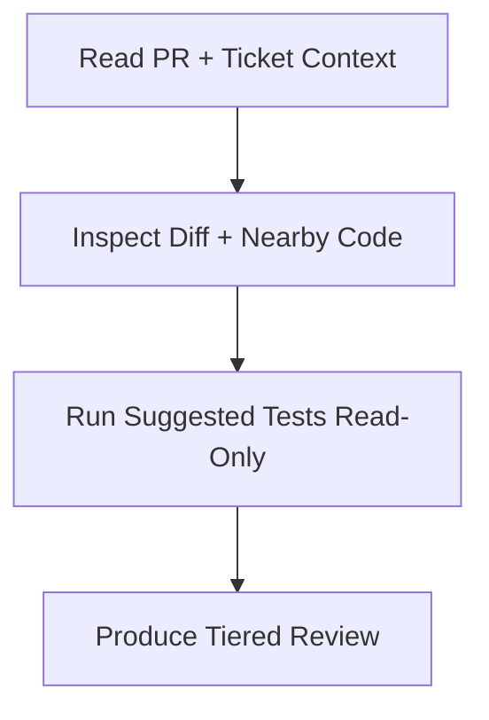

# AGENTS.md

Guidance for agents working in `review-skill`.

## Scope

This repository contains a single portable skill spec for `/review`.
Keep changes focused on:

- `SKILL.md` behavior and wording
- documentation clarity in `README.md`
- portability across environments (no company-internal assumptions)

## Rules

- Keep branding generic and open-source friendly.
- Keep the skill read-only by default (no commits, pushes, or PR comments).
- Prioritize signal over noise; only surface truly actionable findings.
- Keep human-facing output concise and structured.

## Validation

Before finishing, verify:

1. `SKILL.md` frontmatter is valid and complete.
2. Review output sections include critical, suggestion, and nit levels.
3. The skill clearly requires contextual review beyond the raw diff.
