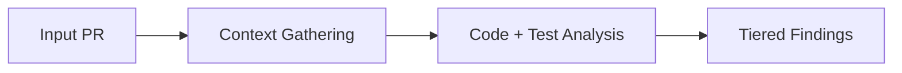

# review-skill

[](https://github.com/dotbrains/review-skill/actions/workflows/ci.yml)
[](https://polyformproject.org/licenses/shield/1.0.0)

Portable `/review` skill for high-signal pull request review:

1. Read PR metadata and description.
2. Read associated ticket to understand scope and intent.
3. Analyze diff plus surrounding code context.
4. Run PR-suggested tests in read-only mode.
5. Produce a structured review with Critical / Suggestions / Nits.



## Repository layout

- `SKILL.md` — canonical skill definition
- `AGENTS.md` — contributor guidance for AI and human maintainers

## Usage

One-line install:

```bash
mkdir -p ~/.claude/skills/review && curl -fsSL https://raw.githubusercontent.com/dotbrains/review-skill/main/SKILL.md -o ~/.claude/skills/review/SKILL.md
```

Invoke with a PR URL or number:

```text
/review https://github.com/owner/repo/pull/123
```

```text
/review 123
```

## Requirements

- `gh` CLI authenticated against your GitHub host
- Access to the repository being reviewed
- Ticket system access if the PR links an external issue
